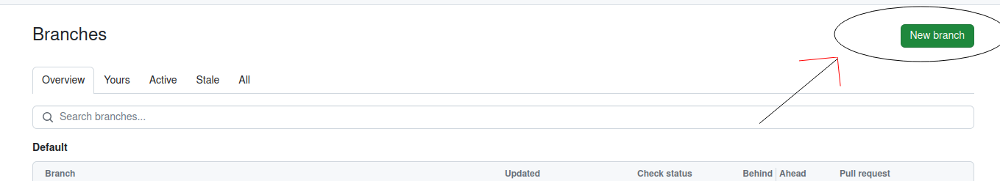
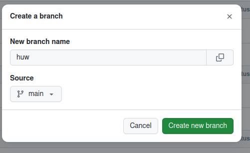

# PAC_app
An  information app for the [Pontardawe Arts Centre](https://pontardaweartscentre.com/) in South Wales. The intention is to have an app that lists events at the venue and allow the user to book tickets.

## What you need to do - making your own branch

If you are going to work on this project, you are going to need to make your own branch. Head over to the [branches](https://github.com/dubway420/PAC_app/branches) section of this repository and click the green `New branch` button in the top right hand corner.

Give your branch a name (a single word, I recommend naming it after yourself). Make sure the source is set as `main`. The hit `Create new branch`.

You should now be able to see you branch in the list. Click on it to go to the files of your branch. 

And that's it! You have successfully created your own branch. Whilst you are on this branch, you can make changes as you wish to the files without worry of messing anything up. If your changes are any good, we can merge them into the `main` branch at a later date. 